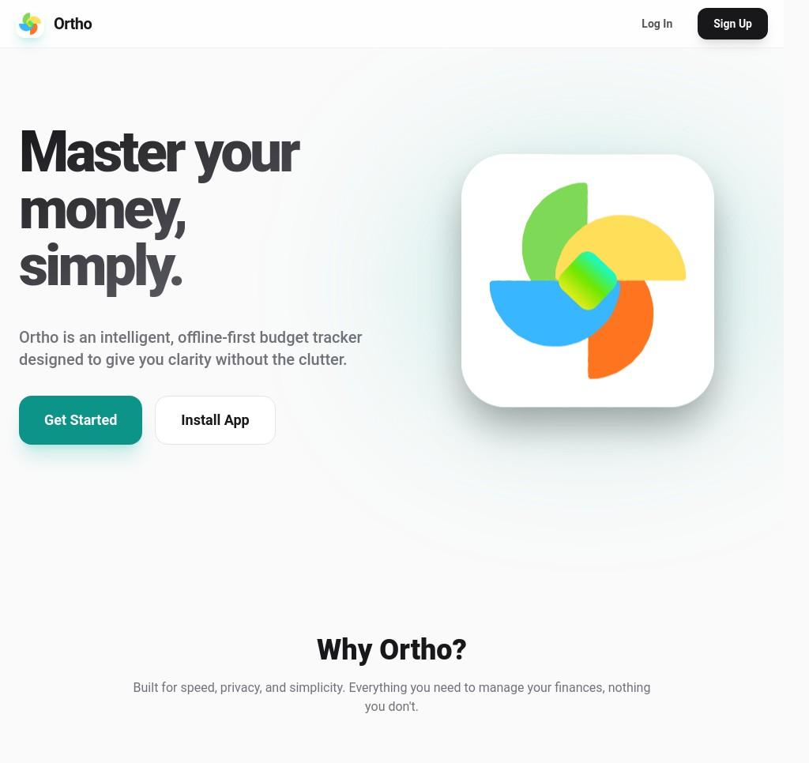

# OrthoBudget

**Master your money, simply.**

Ortho is an intelligent, offline-first budget tracker designed to give you clarity without the clutter. It's built for speed, privacy, and simplicity, providing everything you need to manage your finances and nothing you don't.

[](#) *(Replace with an actual screenshot of your app)*

## ✨ Why Ortho?

In a world of complex financial tools, Ortho focuses on what truly matters: helping you understand your money with ease and complete privacy.

### 🧠 Smart Insights
Gain intelligent analysis of your spending habits without being overwhelmed by complex charts. Ortho helps you identify patterns and opportunities to save more effectively.

### 🔒 Privacy First
shahaduddin financial data belongs to you. Ortho is built with an **offline-first** approach, storing shahaduddin information locally on shahaduddin device. We offer optional cloud backup for convenience, but the choice is always shahaduddins.

### 📊 Detailed Reports
Get clear, visual breakdowns of your income, expenses, and net worth over time. Understand your financial progress at a glance and export your data whenever you need it.

## 🚀 Live Demo

Experience OrthoBudget for yourself:
[https://orthobudget.vercel.app](https://orthobudget.vercel.app)

## 🛠️ Built With

*(This section should list the key technologies, frameworks, and libraries you used. Here are some common ones for a project like this - please update them to match your actual stack!)*

*   **Framework:** [React](https://reactjs.org/) with [Vite](https://vitejs.dev/)
*   **Language:** [TypeScript](https://www.typescriptlang.org/)
*   **Styling:** [Tailwind CSS](https://tailwindcss.com/)
*   **Database/Storage:** IndexedDB (via [Dexie.js](https://dexie.org/)) for local storage / [Supabase](https://supabase.com/) (via [`@supabase/supabase-js`](https://github.com/supabase/supabase-js)) for auth
*   **Deployment:** [Vercel](https://vercel.com/)
*   **Charts:** [Recharts](https://recharts.org/)

## ✍️ Getting Started for Development

Follow these instructions to get a copy of the project up and running on your local machine for development and testing purposes.

### Prerequisites

*   Node.js (v18 or later recommended)
*   npm, yarn, or pnpm

### Installation

1.  **Clone the repository**
    ```bash
    git clone https://github.com/shahaduddin/orthobudget.git
    cd orthobudget
    ```

2.  **Install dependencies**
    ```bash
    npm install
    # or
    yarn install
    # or
    pnpm install
    ```

3.  **Run the development server**
    ```bash
    npm run dev
    # or
    yarn dev
    # or
    pnpm dev
    ```

4.  Open [http://localhost:3000](http://localhost:3000) with your browser to see the result.

## ☁️ Optional Cloud Backup

*(Briefly describe how the optional cloud backup works, if implemented. For example: "Ortho can optionally sync your data with a secure cloud provider. To enable this feature, you need to..." If not yet implemented, you can note it as a planned feature.)*

## 🤝 Contributing

Contributions are what make the open-source community such an amazing place to learn, inspire, and create. Any contributions you make are **greatly appreciated**.

If you have a suggestion that would make this better, please fork the repo and create a pull request. You can also simply open an issue with the tag "enhancement".

1.  Fork the Project
2.  Create your Feature Branch (`git checkout -b feature/AmazingFeature`)
3.  Commit your Changes (`git commit -m 'Add some AmazingFeature'`)
4.  Push to the Branch (`git push origin feature/AmazingFeature`)
5.  Open a Pull Request

## 📝 License

Distributed under the MIT License. See `LICENSE.txt` for more information.

## 📧 Contact

Shahad Uddin - [@theshahaduddin](https://twitter.com/theshahaduddin) - hello@shahaduddin.com

Project Link: [https://github.com/shahaduddin/orthobudget](https://github.com/shahaduddin/orthobudget)
